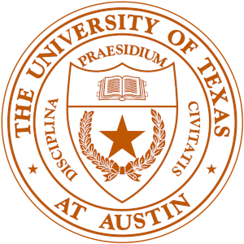
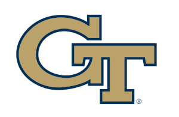

# Benjamin Manning, PhD  

### Contact Information  

Location: Atlanta, GA  
Email: <a href="mailto: benjaminbmanning@gmail.com">benjaminbmanning@gmail.com</a> 
Phone: <a href="tel:+17063442878">706-344-2878</a> 
Social Media: <a href="http://www.linkedin.com/in/atldata">LinkedIn Page</a>

### Summary
Over two decades of leadership and practical experience in engineering and education. Seasoned Data Scientist and Senior Data/MLOps Engineer; AWS Certified. IBM Certified. OpenShift and Kubernetes Certified

### Skills

High-level Synopsis:  

1. Languages (Python, R, Julia, SQL, C, Rust) 
1. OS: Linux (Debian, Mint, RHEL , Ubuntu)
1. CICD: GitLab

Data Science:  

1. Python (Pandas, MatPlotLib, Sci-Kit Learn, Numpy), R, Julia, PySpark
1. IBM CP4D, Watson
1. AWS Athena, Quicksight, EMR, Elasticsearch, AWS Sagemaker
1. GCP AI Studio (Vertex AI)
1. Azure Databricks
1. Keras, Tensorflow, Tensorflow Federated, TinyML, PyTorch, FATE
1. DataRobot

Data Engineering, MLOps:  

1. CI/CD: GitLab, CodeCommit, CodeDeploy
1. IaaS: TerraForm, Cloudformation, Ansible
1. Containers: Docker, Kubernetes, AWS EKS
1. Orchestration: MLflow, Kubeflow, Airflow
1. Data Ingestion: Kafka, NiFi, PubSub
1. Warehouses: Snowflake, Redshift, BigQuery

Machine Learning Model Deployment Stacks:  

1. AWS EKS via Kubeflow, Sagemaker to EC2
1. GCP AI Studio to Kubernetes with Kubeflow
1. Flask on EC2 or GCP compute resource with REST
1. Served model as a microservice (usually Lambda or GCP Cloud Function)

Blockchain:  

1. Hyperledger Fabric
1. Solidity
1. Smart Contracts

### Experience

  
**Artificial Intelligence Research Engineer  
Lockheed Martin  
Jan 2023 – Present**  

*A member of the Aimlabs team, which is part of the Lockheed Martin Artificial Intelligence Center (LAIC), I help drive focus on building a strong and vibrant AI/ML community including tools, knowledge sharing, events, and training. I drive adoption of MLOps and DataOps solutions through interactions within Lockheed Martin’s developer community while providing strategic guidance and high-level support to AI/ML developers*  

  
**Data Scientist / Engineer  
IBM  
Mar 2021 – Jan 2023**  

*Member of IBM Client Engineering, National, Specialty Focus Areas. Data Science/Engineering role with focus on building data pipelines, machine learning models, and AI components for IBM client MVP applications.*      

  
**Senior Data Science Mentor  
The University of Texas at Austin  
Apr 2014 – Jan 2023**  

*Nightly teaching via Experiential Teaching Online, currently serving as the Senior Data Science mentor at University of Texas - Austin CPE where I mentor adult professional education students in Data Science and Machine Learning.*

  
**Chief Analytics Officer  
Socratic Arts  
Mar 2022 – Jan 2023**

*Managed all data and innovation product development initiatives for XTOL (sister company), including constructing and managing data science and data analytics teams, developing data related solutions for external partners and driving continual company growth through innovation.*  

**Senior Data Scientist  
Socratic Arts  
Apr 2014 – Mar 2022**

*I assisted Fortune 100 companies and energy partners with their Data Science and Machine Learning needs such as migrations, project, educational and team development and management, governance and implementation.*

**Example projects types (mainly business, engineering and IoT):**

1. Created and deployed production predictive models for Customer 360 Lifecycle using Supervised and Unsupervised Learning with R, Python, Jupyter and AWS/Sagemaker.
2. Created and Implemented Sentiment Analysis and Automated Keyword Extraction projects with Spark, AWS (EMR) and with Spark and NLTK and/or Spark/MLLib
3. Ops / Deployment - MLflow or Kubeflow or Argo and EKS, Seldon, Tensorflow Server, Flask/EC2

  
**Senior Research Scientist  
Georgia Institute of Technology
Mar 2021 – Oct 2021**

*My research was at the intersection of Big Data Engineering, Machine Learning, and Cyber Operations. Work included Big Data Analytics and Big Data Engineering (ETL) with Spark, DevOps within Kubernetes, and streaming data ingestion with Kafka.*

  
**Lead Data Engineer  
Hashmap, LLC  
Sep 2018 – Aug 2019**

*Consulting role overseeing the creation and growth of Data Engineering vertical for this Big Data consulting company for energy clients.Created numerous analytics pipeline pipeline migrations for Oil and Gas customers using AWS Kenesis, Snowflake, AWS S3 and AWS Quicksight. Created Machine Learning solutions for drill process optimization using Python, GCP BigQuery, AIgym, GCP AI Studio or NiFi, AWS Kinesis and AWS Sagemaker. Assisted with prem-to-cloud migrations using Spark and Databricks on Azure.*

  
**Engineering Faculty  
University of Georgia College of Engineering  
Jul 2016 – May 2019**

*Engineering instructional faculty: Areas of focus Informatics, Computer Systems Engineering, Computational Engineering Methods, Senior Capstone.*

**Initiatives**
1. College of Engineering Diversity Task Force Initiative Representative
2. Founder and Sponsor of Data Dawgs - Interdisciplinary Data Science Student Club 
3. Founding member of Georgia Informatics Institutes

  
**Program Manager and Big Data Architect  
DeVry University  
Nov 2007 – Apr 2015** 

*Senior leadership position managing a large portfolio of curriculum development projects and programs for sixty-six campuses and online. Created data driven solutions for managing national persistence and completion rates; planning and implementation of innovation initiatives. Worked with Python, R, Hadoop, AWS, SQL, SAS*

**Neill Development  
Software Engineer  
Jun 2002 – Nov 2007**

## Education

  
**The University of Georgia  
Doctor of Philosophy - PhD, Computer Engineering** 

*Research areas: Renewable Energy / Deep Learning / Genetic Algorithms / Systems Design
Dissertation: Improving Hybrid Global Horizontal Irradiance Prediction Using Deep learning and Sky Images*

  
**Colorado State University
Doctor of Philosophy - PhD (ABD), Systems Engineering**

*Research areas: Using machine learning to detect early on-set Alzheimer's Disease. Deep study of EEG data and using it for design and controlling Brain Controlled Interfaces.*

  
**The University of Southern Mississippi
MS, Engineering Technology   
BS, Engineering Technology**  

*Emphasis Area: Neural Networks and Machine Learning
Thesis: Using Neural Networks to Decrease the Deficiencies in Raytracing Algorithms.*

## Licenses & certifications

1. DoD Mandatory Controlled Unclassified Information (CUI) Training - Defense Counterintelligence and Security Agency (DCSA)
Issued Mar 2021

1. Enterprise Design Thinking Practitioner - IBM
Issued Jun 2021

1. IBM Global Sales School for Technology Garage - IBM
Issued Jul 2021

1. Introduction to Containers, Kubernetes, and OpenShift - IBM
Issued Aug 2021

1. Blockchain Essentials - IBM
Issued Aug 2021
Credential ID 3557ecdf20144039b62eeadf3d1f7891

1. Maximo Visual Inspection Intermediate - IBM
Issued Oct 2021

1. IBM Cloud Pak for Data V3.0.x Data Science - IBM
Issued Jun 2021

1. IBM Machine Learning Specialist - Associate - IBM
Issued Feb 2022

1. Amazon Certified Cloud Practitioner - Amazon Web Services
Nov 2019

## Honors & awards

**1. Google Internet of Things (IoT) Technology Research Award Pilot - Google**

*Over the past year, Google engineers have experimented and developed a set of building blocks for the Internet of Things - an ecosystem of connected devices, services and “things” that promises direct and efficient support of one’s daily life. While there has been significant progress in this field, there remain significant challenges in terms of (1) interoperability and a standardized modular systems architecture, (2) privacy, security and user safety, as well as (3) how users interact with, manage and control an ensemble of devices in this connected environment.*

**Postdoctoral Research in Deep Learning - University of Georgia School of Computer Science**

